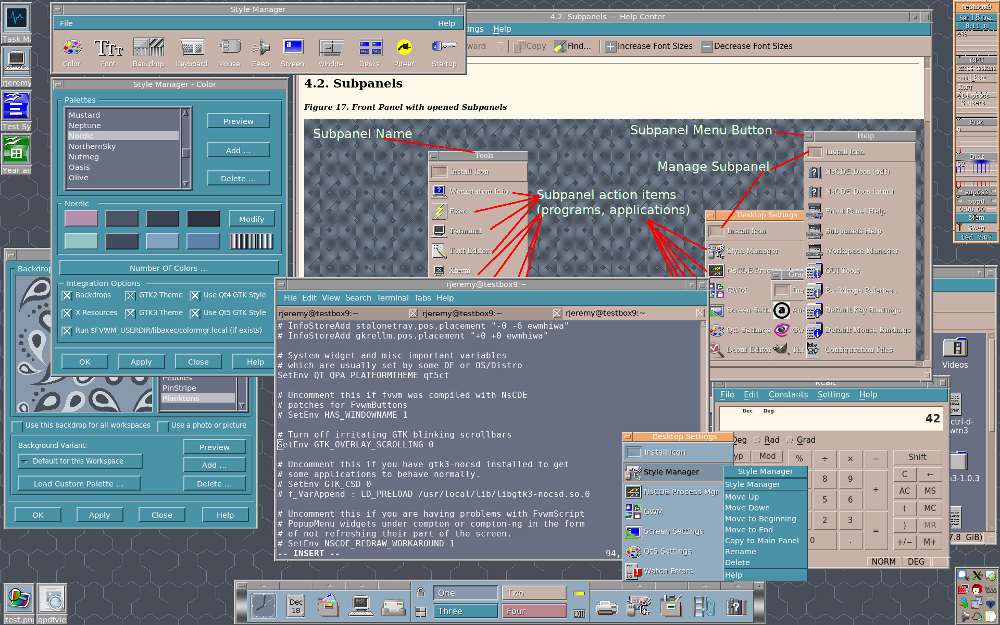

# **Not so Common Desktop Environment (NsCDE)**

Notices:
- For a full documentation, see share/doc/NsCDE/*
- FAQ: https://github.com/NsCDE/NsCDE/wiki/NsCDE---Frequently-Asked-Questions-(FAQ)

Screenshots:
- https://imgur.com/gallery/nHkw35X
- https://imgur.com/gallery/RroGvLH

Video Presentations and guides:
- https://www.youtube.com/watch?v=BwuTOghS3ac&list=PLpVwwj0aIJjeHbA38F1z693-fKIC8IHS5
Set of 12 NsCDE video presentations (commented and titled screen captures) on
NsCDE Youtube channel.

- https://www.youtube.com/playlist?list=PLpVwwj0aIJjcaTFrZ5FLokl-kAMwmBxux
Set of newer 7 NsCDE video presentations, describing features implemented in
the last two years and for NsCDE 2.X

Author will like to apologize for bad english in docs. A rand() function putting
articles (the, a, an) will probably be more accurate.

# **Introduction**

### What is **NsCDE**?

   **NsCDE** is a retro but powerful `UNIX desktop environment` which
   resembles `CDE` look (and partially feel) but with a more powerful
   and flexible framework beneath-the-surface, more suited for 21st
   century `unix-like` and `Linux` systems and user requirements than
   original `CDE`.

   **NsCDE** can be considered as a heavyweight `FVWM`
   theme on steroids, but combined with a couple other free software
   components and custom `FVWM` applications and a lot of configuration,
   **NsCDE** can be considered a lightweight hybrid desktop environment.

   In other words, **NsCDE** is a heavy `FVWM` (ab)user. It consists of a
   set of `FVWM` applications and configurations, enriched with Python
   and Shell background drivers, couple of the additional free software
   tools and applications. `FVWM3` is also supported.

   Visually, **NsCDE** mimics `CDE`, the well known `Common Desktop Environment`
   of many commercial UNIX systems of the nineties. It supports `CDE` backdrops
   and palettes with `FVWM` colorsets and has a theme generator for `Xt`, `Xaw`,
   `Motif`, `GTK2`, `GTK3`, `Qt4` and `Qt5`. Integrating all these bits and 
   pieces, the user gets a retro visual experience across almost all `X11` 
   applications. Enriched with a bunch of powerful `FVWM` concepts and functions,
   modern applications and font rendering, **NsCDE** acts as a link between
   classic `CDE` look and a fast and extensible environment, well suited for 
   modern day computing.

   **NsCDE** can even be integrated into existing desktop environments as a
   `FVWM` window manager wrapper for session handling and additional `DE`
   functionality.

   Nevertheless, **NsCDE** is designed for UNIX oriented users, and
   generally technical persons, and not as something for general public
   use or for introducing beginners to a Linux or some other `unix-like`
   system.

   As said, NsCDE's main goal is to revive the look and feel of the `Common 
   Desktop Environment` found on many `UNIX` and `unix-like` systems during 
   nineties and the first decade of the 21st century, but with a slightly 
   polished interface (XFT, unicode, dynamic changes, rich key and mouse 
   bindings, desk pages, rich menus etc.). The goal is a comfortable `retro` 
   environment which is not just eye candy toy, but a real working environment 
   for users who contrary to mainstream trends really like `CDE`, thus making
   semi-optimal blend of usability and compatibility with modern tools with
   a look and feel which mainstream abadoned for some new fashion, and ... in a
   nutshell, giving to user the best of the both worlds.

   the excellent `FVWM` window manager is the main driver behind **NsCDE** with its
   endless options for customization, GUI Script engine, Colorsets, and
   modules. **NsCDE** is largely a wrapper around `FVWM` -- sort of like a
   heavyweight theme.

   Other main components are `GTK2`, `GTK3`, `Qt4` and `Qt5` theme for unifying 
   look and feel for most Unix/Linux applications, custom scripts which are
   helpers and backend workers for GUI parts and some data from the original
   `CDE`, such as icons, palettes, and backdrops.

   --------------------------------------------------------------------------

### Why **NsCDE**?

   Since the nineties, I have always liked this environment and its somewhat
   crude socrealistic look in a contrast to "modern" Windows and `GNOME`
   approach which is going in the opposite taste from what I always liked to
   see on my screen. I have created this environment for my own usage 8-10
   years ago and it was a patchwork, chaotic and not well suited for sharing
   with someone. While it looked ok on the surface, behind it was years of
   ad hoc hacks and senseless configurations and scripts, dysfunctional menus
   etc. Couple of months in a row I had the time and chance to rewrite this as
   a more consistent environment, first for myself, and during this process,
   idea came to do it even better, and put it on the web for everyone else who
   may like this idea of a modern `CDE`.

   **NsCDE** is intended for people who don't like "modern" hypes,
   interfaces that try to mimic Mac and Windows and reimplement their
   ideas for non-technical user's desktops, and reimplementing them poorly.
   Older and mature system administrators, programmers and generally people
   with a Unix background are more likely to have attraction to **NsCDE**. It
   is probably not well suited for beginners.

   Of course, the question arises: why not simply use the original `CDE` now
   that it is open source?

   Apart from its desirable look, because it has its own problems: It is a
   product from the 90s, based on Motif and a long time has passed since then. In
   `CDE` there is really no XFT font rendering, no immediate application
   dynamic changes. Beside that, I have found `dtwm`, CDE's window manager,
   inferior to `FVWM` and some 3rd party solutions which can be paired with it.
   So I wanted the best of the two worlds: good old retro look and feel from
   original `CDE`, but more flexible, modern and maintained "driver" behind it,
   which will allow for individual customizations as one find's them fit for
   their own amusement and usage. As it will be seen later, there are some
   intentional differences between `CDE` and **NsCDE** - a middle line between
   trying to stay as close as possible to look of the `CDE`, but with more
   flexibility and functionality on the second and third look.

   --------------------------------------------------------------------------

### Components of the **NsCDE**

#### Components overview

   **NsCDE** consists of 7 main facilities

   * extensive `FVWM` configuration and customization
   * FvwmScript GUI programs
   * GTK2 and GTK3 theme based on pixmap engine
   * Icon theme
   * Python programs and Korn Shell scripts
   * Misc pieces for integration, like CSS for `Firefox` and `Thunderbird` etc ...
   * Integrated free software components for desktop environment tasks

   Central "driver" or framework is FVWM Window Manager. `FVWM` is in my opinion
   a model of free choice for people who like to have things set up by their own
   wishes and and who are aware what real freedom of choice is. A stunning
   contrast to policies forced on Linux users in the last decade from the
   most mainstream desktop players.

   **NsCDE** is by default installed in `/usr/local` (`$NSCDE_ROOT`), but it can
   be relocated to any other installation path during pre-installation
   configuration.

   It is not using default configuration directory `$HOME/.fvwm` but sets it's
   own `$FVWM_USERDIR` to `$HOME/.NsCDE`, and uses **NsCDE** private
   `$[FVWM_DATADIR]` as a sources of configuration.

