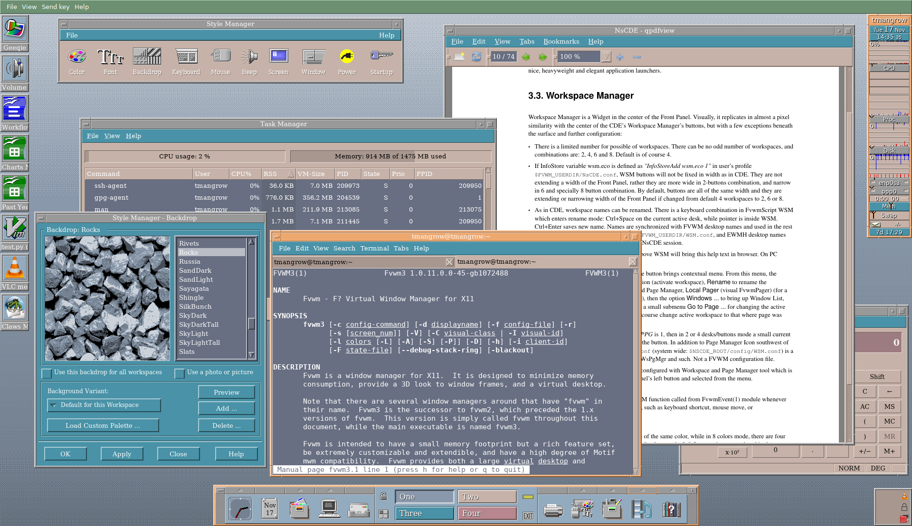

# **Not so Common Desktop Environment (NsCDE) - 中文版**

[](https://github.com/wenyinos/NsCDE-zh)
[](https://github.com/wenyinos/NsCDE-zh/releases)
[](https://github.com/wenyinos/NsCDE-zh/pull/new)

**语言: [English](README.md) | [中文](README.zh.md)**



**NsCDE-zh** 是 NsCDE 的中文本地化版本，提供完整的中文简体支持。

## 功能特性

- 🌏 完整的中文（简体）翻译，包含 25+ 个语言文件
- 🎨 默认使用 Noto Sans CJK SC 字体，确保中文正确显示
- 🎯 复古 CDE 外观与现代功能兼具
- 💻 基于 FVWM 的轻量级桌面环境
- ⚙️ GTK2/GTK3/Qt4/Qt5 主题集成
- 🎭 带有 GUI 配置的色彩和字体样式管理器
- 📱 **默认应用程序管理器** - 图形界面对话框，用于设置默认终端、编辑器、文件管理器、浏览器等
- 🗂️ **pcmanfm-qt 集成** - 应用程序管理器模式，可从 NsCDE 菜单、根菜单和子面板访问
- 🌐 **系统信息增强** - 工作站信息对话框显示最后启动时间

## 安装

### 从 DEB 包安装

#### Debian

```bash
# 下载并安装 Debian 软件包（将 VERSION 替换为实际版本号，例如 2.3.10）
wget https://github.com/wenyinos/NsCDE-zh/releases/download/vVERSION+zh/nscde-zh_VERSION+zh-1_amd64.deb
sudo apt install ./nscde-zh_VERSION+zh-1_amd64.deb
```

#### Ubuntu

```bash
# 下载并安装 Ubuntu 软件包（将 VERSION 替换为实际版本号，例如 2.3.10）
wget https://github.com/wenyinos/NsCDE-zh/releases/download/vVERSION+zh/nscde-zh_VERSION+zh-1ubuntu1_amd64.deb
sudo apt install ./nscde-zh_VERSION+zh-1ubuntu1_amd64.deb
```

### 从 RPM 包安装

```bash
# 从 releases 页面下载最新 RPM
# https://github.com/wenyinos/NsCDE-zh/releases

# 或直接安装（将 VERSION 替换为实际版本号）
sudo dnf install https://github.com/wenyinos/NsCDE-zh/releases/download/vVERSION/NsCDE-VERSION-1.zh.fc43.x86_64.rpm
```

### 从 Arch Linux（AUR）安装

```bash
# 使用 AUR helper
paru -S nscde-zh

# 或从源码构建 (pkg/pacman/PKGBUILD)
makepkg -si
```

### 从源码编译安装

```bash
./autogen.sh
./configure --prefix=/usr
make
sudo make install
```

## 依赖

```
ksh xterm sed fvwm cpp xsettingsd stalonetray dunst xclip xdotool
python3-pyxdg python3-psutil qt5ct
python3-yaml PyQt5 qt5-qtstyleplugins dex-autostart groff-base
dejavu-serif-fonts google-noto-sans-cjk-fonts google-noto-sans-mono-cjk-vf-fonts
google-noto-sans-mono-fonts convert import xrdb xset xprop xdpyinfo xrandr
xdg-utils gettext
```

## 使用方法

1. 从显示管理器启动 NsCDE 会话
2. 使用**字体样式管理器**配置字体
3. 使用**色彩样式管理器**配置颜色和主题

## 字体配置

默认使用 **Noto Sans CJK SC** 和 **Noto Sans Mono CJK SC** 字体显示中文。

### 安装字体

```bash
# Debian/Ubuntu
sudo apt install fonts-noto-cjk fonts-noto-cjk-extra

# Fedora/RHEL
sudo dnf install google-noto-sans-cjk-fonts google-noto-sans-mono-cjk-vf-fonts
```

### 手动配置 DPI

如果中文显示为方框，可能是 DPI 不匹配：

```bash
# 查看当前 DPI
xrdb -query | grep Xft.dpi

# 编辑配置文件（根据实际 DPI 修改）
sed -i 's/Xft.dpi: 96/Xft.dpi: 120/' ~/.NsCDE/Xdefaults.fontdefs
xrdb -merge ~/.NsCDE/Xdefaults.fontdefs
```

### 配置文件位置

| 文件 | 说明 |
|------|------|
| `~/.NsCDE/Xdefaults.fontdefs` | Xft 字体定义 |
| `~/.NsCDE/Font-*.fvwmconf` | FVWM 窗口管理器字体 |
| `~/.NsCDE/Xsettingsd.conf` | GTK/Qt 应用程序字体 |

## 截图

查看 [NsCDE 图片集](https://imgur.com/gallery/nHkw35X)

## 文档

- 维基: https://github.com/wenyinos/NsCDE-zh/wiki
- 常见问题: https://github.com/wenyinos/NsCDE-zh/wiki/NsCDE---Frequently-Asked-Questions-(FAQ)
- 视频: https://github.com/wenyinos/NsCDE-zh/wiki/NsCDE---Video-presentations-and-tutorials
- 安装后可在 `share/doc/NsCDE/` 找到完整的离线文档。

## 许可证

GPLv3 - 详见 [COPYING](COPYING) 文件。

## 链接

- GitHub: https://github.com/wenyinos/NsCDE-zh
- 上游 NsCDE: https://github.com/NsCDE/NsCDE
- 维基: https://github.com/wenyinos/NsCDE-zh/wiki
- 常见问题: https://github.com/wenyinos/NsCDE-zh/wiki/NsCDE---Frequently-Asked-Questions-(FAQ)

---

# **介绍**

### 什么是 **NsCDE**？

**NsCDE** 是一个复古而强大的 UNIX 桌面环境，它模仿了 CDE 的外观（和部分操作感受），但在表面之下拥有更强大、更灵活的框架，比原始的 CDE 更适合 21 世纪的类 Unix 和 Linux 系统及用户需求。

**NsCDE** 可以被视为一个增强版的重型 FVWM 主题，但结合了其他一些自由软件组件、自定义 FVWM 应用程序和大量配置后，**NsCDE** 可以被认为是一个轻量级的混合桌面环境。

换句话说，**NsCDE** 是 FVWM 的深度（滥）用者。它由一套 FVWM 应用程序和配置组成，并辅以 Python 和 Shell 后台驱动以及一些额外的自由软件工具和应用程序。同时也支持 FVWM3。

在视觉上，**NsCDE** 模仿 CDE——90 年代许多商业 UNIX 系统上著名的通用桌面环境（Common Desktop Environment）。它支持使用 FVWM 色彩集的 CDE 背景和调色板，并为 Xt、Xaw、Motif、GTK2、GTK3、Qt4 和 Qt5 提供了主题生成器。通过整合所有这些组件，用户在几乎所有 X11 应用程序中都能获得复古的视觉体验。结合大量强大的 FVWM 概念和功能、现代应用程序和字体渲染，**NsCDE** 在经典 CDE 外观与快速可扩展环境之间架起了一座桥梁，非常适合现代计算需求。

**NsCDE** 甚至可以集成到现有的桌面环境中，作为 FVWM 窗口管理器的包装器来处理会话和其他桌面环境功能。

不过，**NsCDE** 是为 UNIX 用户和技术人员设计的，不适合普通大众使用，也不适合向初学者介绍 Linux 或其他类 Unix 系统。

如前所述，NsCDE 的主要目标是重现 90 年代及 21 世纪头十年许多 UNIX 和类 Unix 系统上的通用桌面环境的外观和操作感受，但界面更加精致（支持 XFT、Unicode、动态更改、丰富的键盘和鼠标绑定、桌面分页、丰富的菜单等）。目标是打造一个舒适的复古环境，它不仅仅是华而不实的玩具，而是真正能用的工作环境——适合那些与主流趋势相反、真正喜欢 CDE 的用户，从而在可用性和现代工具兼容性之间取得半最优的平衡，同时保留主流界面因追逐新潮流而抛弃的外观感受。简而言之，为用户提供两全其美的体验。

优秀的 FVWM 窗口管理器是 **NsCDE** 的主要驱动力，它拥有无尽的定制选项、GUI 脚本引擎、色彩集和模块。**NsCDE** 在很大程度上是 FVWM 的一个包装器——类似于一个重型主题。

其他主要组件包括用于统一大多数 Unix/Linux 应用程序外观的 GTK2、GTK3、Qt4 和 Qt5 主题，以及作为 GUI 部分的辅助和后端工作的自定义脚本，还有来自原始 CDE 的一些数据，如图标、调色板和背景。

---

### 为什么选择 **NsCDE**？

自 90 年代以来，我一直喜欢这个环境及其略显粗糙的社会现实主义风格，与"现代"的 Windows 和 GNOME 方法形成鲜明对比——后者正朝着与我一直希望在屏幕上看到的相反方向发展。我在 8-10 年前为自己创建了这个环境，它当时是一个拼凑物，混乱且不适合与别人分享。虽然表面看起来还不错，但背后是多年临时拼凑的破解方案、毫无意义的配置和脚本、功能失调的菜单等。后来我连续几个月有了时间和机会，将其重写为一个更一致的环境——首先是为了自己，在这个过程中，我萌生了把它做得更好并放到网上的想法，让其他可能喜欢这种现代 CDE 理念的人也能使用。

**NsCDE** 面向那些不喜欢"现代"炒作的人——不喜欢那些试图模仿 Mac 和 Windows 并为其非技术用户桌面重新实现其理念（而且实现得很糟糕）的界面。年长而成熟系统管理员、程序员以及一般具有 Unix 背景的人更有可能对 **NsCDE** 产生兴趣。它可能不太适合初学者。

当然，问题来了：既然原始 CDE 已经开源，为什么不直接使用它呢？

除了它理想的外观之外，因为它有自己的问题：它是 90 年代的产品，基于 Motif，距离现在已经很久了。在 CDE 中，没有 XFT 字体渲染，没有即时的动态应用程序更改。除此之外，我发现 CDE 的窗口管理器 dtwm 不如 FVWM 以及一些可以与它配合使用的第三方解决方案。所以我希望两全其美：保留原始 CDE 的经典复古外观和感受，但在其背后有一个更灵活、更现代且持续维护的"驱动引擎"，允许用户根据自己的喜好和用途进行个性化定制。稍后将会看到，CDE 和 **NsCDE** 之间存在一些有意为之的差异——这是一种折中方案，既尽可能贴近 CDE 的外观，又在深入使用后展现出更多的灵活性和功能性。

---

### **NsCDE** 的组件

#### 组件概览

**NsCDE** 包含 7 个主要组成部分：

* 广泛的 FVWM 配置和定制
* FvwmScript GUI 程序
* 基于像素图引擎的 GTK2 和 GTK3 主题
* 图标主题
* Python 程序和 Korn Shell 脚本
* 用于集成的杂项组件，如 Firefox 和 Thunderbird 的 CSS 等
* 用于桌面环境任务的集成自由软件组件

中央"驱动引擎"或框架是 FVWM 窗口管理器。在我看来，FVWM 是为那些喜欢按自己意愿设置一切、并且懂得什么是真正选择自由的人们提供的自由选择典范。这与过去十年主流桌面厂商强加给 Linux 用户的策略形成了鲜明对比。

**NsCDE** 默认安装到 `/usr/local`（`$NSCDE_ROOT`），但可以在预安装配置期间重定位到任何其他安装路径。

它不使用默认的配置目录 `$HOME/.fvwm`，而是将其 `$FVWM_USERDIR` 设置为 `$HOME/.NsCDE`，并使用 **NsCDE** 私有的 `$[FVWM_DATADIR]` 作为配置来源。
